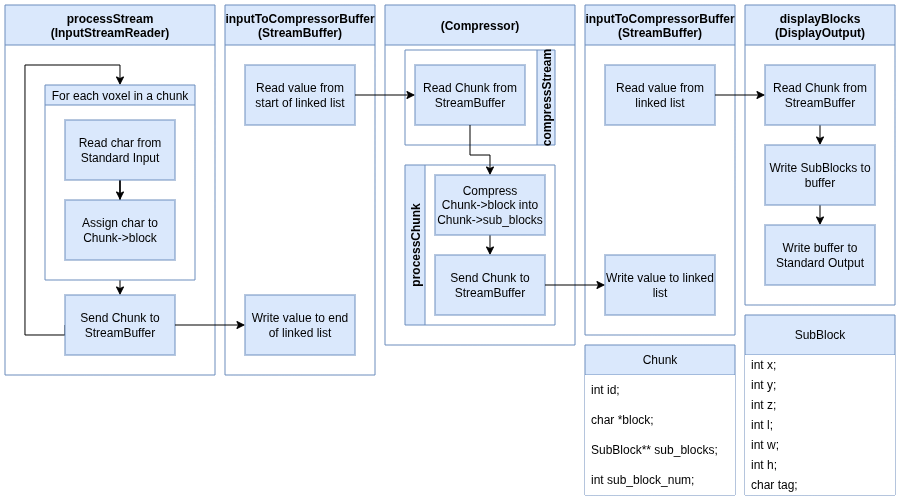

# The Block Model Compression Algorithm

## Description

The Block Model Compression Algorithm is designed to reduce the size of geological block models while preserving critical spatial and compositional information. It works by identifying patterns and redundancies in the data, then compressing blocks of similar attributes together. This reduces storage requirements and speeds up data processing and transmission, while maintaining the accuracy of geological features for analysis, visualization, and modeling.

## Setup Instructions

### Prerequisites

- **C++ Compiler** (g++ recommended)
- **Make** (for Linux/macOS builds)
- **Git** (optional, for cloning the repository)

### Unix (with `make`)

1. Building The Program:
   ```bash
      make
   ```

### Windows

1. Open a command prompt in the project directory.

2. Compile using g++:
   ```bash
     g++ -Wall -Iinclude -pthread -static -o myapp.exe src/Compressor.cpp src/DisplayOutput.cpp src/StreamProcessor.cpp src/StreamBuffer.cpp src/OctTreeNode.cpp src/InputStreamReader.cpp src/ProcessorModule.cpp src/main.cpp
   ```
3. This produces myapp.exe.

### Building the Test Program

1. Linux/macOS:
   ```bash
      make win-test
   ```
2. Windows:
   ```bash
      g++ -Wall -Iinclude -pthread -static -o myapp_test.exe src/Compressor.cpp src/DisplayOutput.cpp src/StreamProcessor.cpp src/StreamBuffer.cpp src/OctTreeNode.cpp src/InputStreamReader.cpp src/ProcessorModule.cpp src/test.cpp
   ```

---

## Features

- **StreamProcessor**: Parses input files and sends the data to the Compressor module for processing.
- **Compressor Algorithms**: Receives raw data from StreamProcessor and performs lossless compression to reduce data size while preserving all information.
- **Testing Tools**: Measures the compression rate and speed of the program.
- **Modularity**: Each component is implemented using OOP, making the system easier to scale, maintain, and modify.
- **Multi-Threading**: Enables concurrent processing of multiple tasks, improving performance and responsiveness of the application.

---

## Known Bugs & Limitations

- **No GUI Interface**: The app sometimes loses connection to MySQL and requires a restart.

---

## Software Architecture


